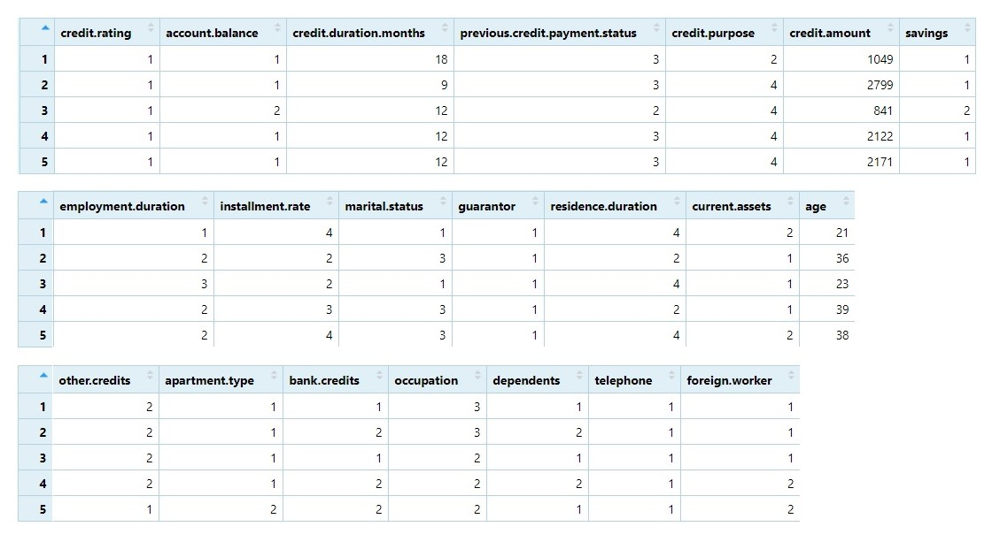
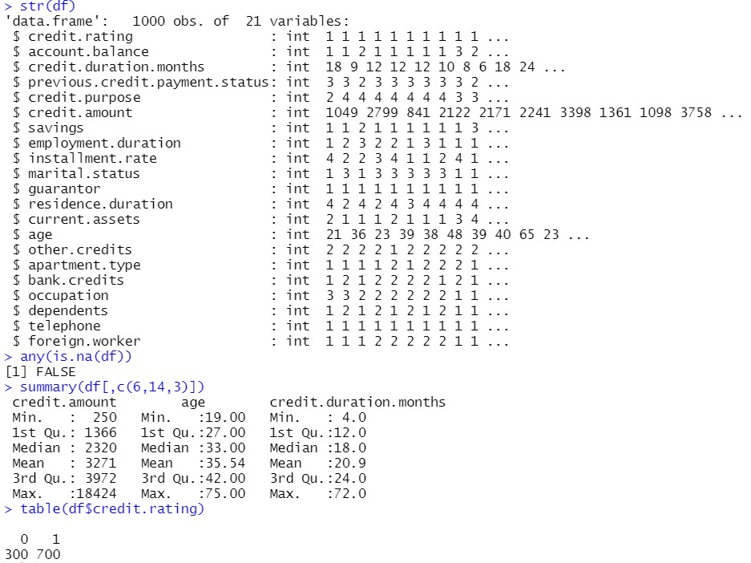
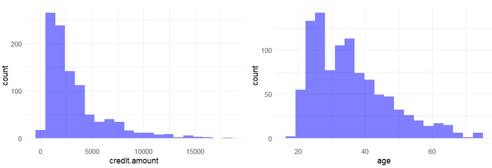
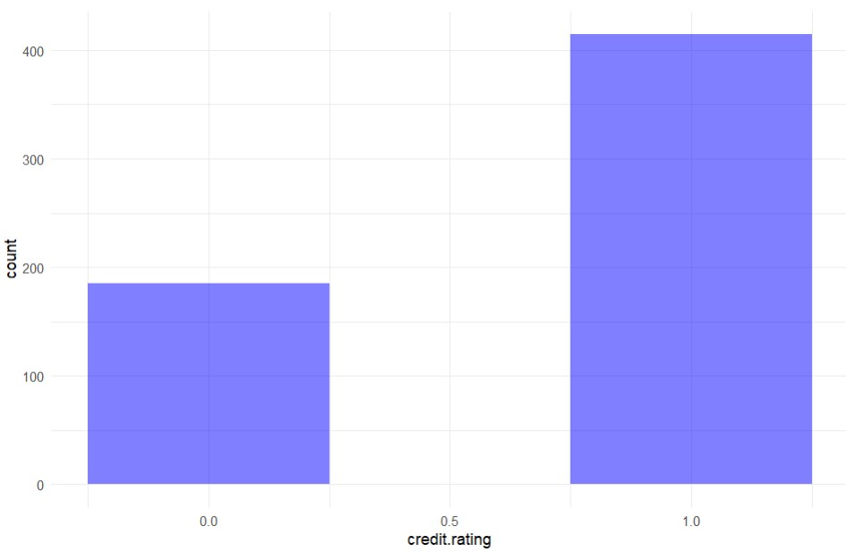
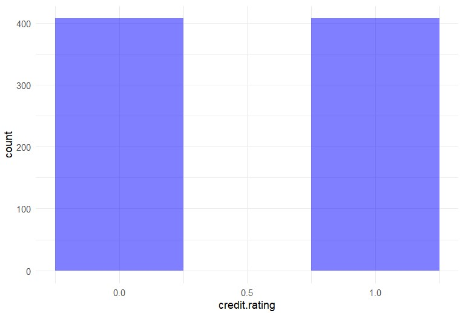

<h1 align="middle">Prevendo se o crédito deve ser ou não concedido. </h1>

<p align="center">
  
</p>

# Índice
* [Sobre o Projeto](#computer-sobre-o-projeto)
* [Descrição Geral do Problema](#gear-descrição-geral-do-problema)
* [Familiarizando-se com o Dataset](#mag-familiarizando-se-com-o-dataset)
  * [Carregando bibliotecas e dataset](#carregando-bibliotecas-e-dataset)
  * [Exploração inicial dos dados](#exploração-inicial-dos-dados)
  * [Pré-Processamento](#pré-processamento)
  * [Análise da Correlação entre as variáveis](#análise-da-correlação-entre-as-variáveis)
* [Solução do Problema](#rocket-solução-do-problema)
  * [Construindo o Modelo](#construindo-o-modelo)
  * [Testando e avaliando o Modelo](#testando-e-avaliando-o-modelo)
  * [Otimizando o Modelo](#otimizando-o-modelo)
 * [Conclusão e Considerações Finais](#bulb-conclusão-e-considerações-finais)
* [Autor](#superhero-autor)

## :computer: Sobre o Projeto
<td><p align=justify>O objetivo deste projeto é praticar o conhecimento adquirido em Machine Learning. Neste projeto foram construídos dois Modelos Preditivos de classificação (Random Forest e Regressão Logística) para prever se o crédito deve ser ou não concedido a determinado cliente de uma instituição financeira, dadas algumas características conhecidas. Para o desenvolvimento do projeto foi utilizada linguagem R (versão 4.2.0) juntamente com as bibliotecas 'ROCR' (versão 1.0-11), 'pROC' (versão 1.18.0), 'caret' (versão 6.0-92), 'randomForest' (versão 4.7-1.1) e 'RSBID' (versão 0.0.2.0000).</p></td>

## :gear: Descrição Geral do Problema
<td><p align=justify>Como forma de reduzir o risco na concessão de crédito, os bancos e instituições financeiras estão sempre gerando melhorias em seus processos de
análise de crédito, nesse sentindo, entendemos como necessária a construção de modelos preditivos capazes de avaliar se um cliente conseguirá ou não pagar por um crédito concedido.</p></td>

## :mag: Familiarizando-se com o Dataset
<td><p align=justify>Para o desenvolvimento do Projeto foram utilizados dados fictícios de 1000 clientes de uma instituição financeira, considerando as seguintes caracterísicas: classificação de crédito, saldo da conta, meses de duração do crédito, status de pagamento de crédito anterior, finalidade do crédito, quantia do crédito, poupança, duração do emprego, taxa de parcelamento, estado civil, fiador, duração da residência, ativo circulante, idade, outros créditos, tipo de apartamento, créditos bancários, ocupação, dependentes, telefone, trabalhador estrangeiro.</p></td>

### Carregando bibliotecas e dataset
```
library(RSBID)
library(randomForest)
library(ROCR)
library(pROC)
library(caret)
```
```
df <- read.csv("credito.csv")
```

### Exploração inicial dos dados
<p align="center">
<i>Primeiras linhas do 'dataset'</i>
</p>
<p align="center">
  
</p>

<p align="center">
<i>Resumo estatístico</i>
</p>
<p align="center">
  
</p>

<p align="center">
<i>Histograma das variáveis "credit.amount" e "age" </i>
</p>
<p align="center">
  
</p>

### Pré-Processamento

Transformando todas as variáveis numéricas em categóricas (exceto "credit.duration.months", "credit.amount" e "age")
```
for (i in colnames(df,do.NULL = FALSE,prefix = "col")){
  if(i!="credit.duration.months"&i!="credit.amount"&i!="age")
  df[,i] <- as.factor(df[,i])
}
```
Normalizando (padronizando) as variáveis "credit.duration.months", "credit.amount" e "age" 
```
scale.features <- function(df, variables){
  for (variable in variables){
    df[[variable]] <- scale(df[[variable]], center=T, scale=T)
  }
  return(df)
}
numeric.vars <- c("credit.duration.months", "age", "credit.amount")
df <- scale.features(df, numeric.vars)
```
Split dos dados (60% para dados de treino e 40% para dados de teste)
```
indexes <- sample(1:nrow(df), size = 0.6 * nrow(df))
df_train <- df[indexes,]
df_test <- df[-indexes,]
```
### Balanceamento dos dados de treino 
Balanceamento
```
df_train <- SMOTE_NC(df_train, 'credit.rating', perc_maj = 100, k = 5)
```
<p align="center">
<i>Histograma da variável "credit.rating antes do balanceamento</i>
</p>
<p align="center">
  
</p>
<p align="center">
<i>Histograma da variável "credit.rating após o balanceamento</i>
</p>
<p align="center">
  
</p>

<td><p align=justify>Como podemos observar pelo histograma da variável "credit.rating", existia uma grande diferença entre o númeto de créditos concedidos ("1") e os não concedidos ("0"), o processo de balanceamento (SMOTE) corrigiu tal discrepância entre os dados, o que possibilitará um melhor aprendizado para o modelo a ser construído nas próximas etapas deste projeto.</b></p></td>

## :rocket: Solução do Problema
<td><p align=justify>Uma vez que concluímos as etapas de exploração dos dados e pré-processamento, confirmando ainda nossa hipótese inicial de que há correlação entre os atributos dos segurados e o seu gasto anual com despesas médicas, buscaremos agora uma solução para o problema inicialmente proposto: <b>estimar as despesas médias dos segurados com base nos seus atributos</b>. Para isso ocorrer, entendemos como necessária a construção de um modelo preditivo, neste caso utilizaremos a <b>Regressão Linear</b> para estimar os valores.</p></td>

### Construindo o Modelo 

Criando as amostras de forma randômica
```
amostra <- sample.split(df$idade, SplitRatio = 0.70)
```
Criando dados de treino - 70% dos dados
```
treino = subset(df, amostra == TRUE)
```
Criando dados de teste - 30% dos dados
```
teste = subset(df, amostra == FALSE)
```
Gerando o Modelo com dados de treino (usando todos os atributos)
```
modelo_v1 <- lm(gastos ~ ., data = treino)
```

Podemos observar que o modelo criado apresenta bom desempenho utilizando os dados de treino (tomando como parâmetro o R-squared).

<p align="center">
  
</p>

Obtendo os resíduos (diferença entre os valores observados de uma variável e seus valores previstos)
```
res <- residuals(modelo_v1)
res <- as.data.frame(res)
```

Histograma dos resíduos
```
ggplot(res, aes(res)) +  
  geom_histogram(bins = 20, 
                 alpha = 0.5, fill = 'blue')
```

<p align="center">
  
</p>

<td><p align=justify>O Histograma acima nos mostra uma distribuicao normal, o que indica que a média entre os valores previstos e os valores observados é proximo de zero, o que é muito bom!</p></td>

### Testando e avaliando o Modelo 

Fazendo as predições com os dados de teste
```
prevendo_gastos <- predict(modelo_v1, teste)
resultados <- cbind(prevendo_gastos, teste$gastos) 
colnames(resultados) <- c('Previsto','Real')
resultados <- as.data.frame(resultados)
```

Tratando os valores negativos
```
trata_zero <- function(x){
  if  (x < 0){
    return(0)
  }else{
    return(x)
  }
}
resultados$Previsto <- sapply(resultados$Previsto, trata_zero)
```

Cálculo da raiz quadrada do erro quadrático médio
```
mse <- mean((resultados$Real - resultados$Previsto)^2)
rmse <- mse^0.5
```

Cálculo do R-squared (O R² ajuda a avaliar o nivel de precisão do modelo, quanto maior, melhor, sendo 1 o valor ideal)
```
SSE = sum((resultados$Previsto - resultados$Real)^2)
SST = sum( (mean(df$gastos) - resultados$Real)^2)
R2 = 1 - (SSE/SST)
```

<p align="center">
  
</p>

<td><p align=justify>Analisando as métricas calculadas acima, <b>concluímos que o modelo apresenta bom desempenho nas predições</b>. No entanto, é importante sempre avaliar se a performance apresentada pode ser melhorada, é o que faremos na próxima etapa do projeto!</p></td>

### Otimizando o Modelo

<td><p align=justify>Nesta etapa tentaremos otimizar a performance do Modelo construído. Antes de efetuar qualquer alteração, precisamos analisar alguns pontos importantes referentes às nossas variáveis preditoras (atributos dos segurados).</p></td>

<td><p align=justify>1 - Idade: É notório que os gastos com saúde tendem a aumentar de maneira desproporcional para a população mais velha. Logo, é interessante acrescentar uma variável que nos permita separar o impacto linear e não linear da idade nos gastos. Isso pode ser feito criando a variável 'idade²' (idade ao quadrado).</p></td>

<td><p align=justify>2 - Índice de massa corporal (BMI): Outra observação a ser feita é com relação às pessoas obesas (BMI >= 30), a obesidade pode ser um preditor importante para os gastos com saúde, uma vez que as pessoas obesas tendem a desenvolver mais doenças. Neste caso podemos acrescentar uma variável 'bmi30' que indique se o segurado é obeso ou não (1 ou 0).</p></td>

<td><p align=justify>3 - Uma vez que criamos a variável 'bmi30' que indica se o segurado é obeso ou não, e considerando que a variável 'fumante' é um forte preditor dos gastos (conforme análise da matriz de correlação na seção 'Familiarizando-se com o Dataset') podemos criar uma outra variável (cujo nome será 'fbmi30') que contemple os segurados que são obesos e ao mesmo tempo fumantes. Neste caso 'fbmi30' = bmi30*fumante, onde '1' indicará se as duas condições estão presentes e '0' se uma ou nenhuma das condições está presente.</p></td>

Acrescentando variáveis 'idade2', 'bmi30' e 'fbmi30' aos dados de treino e teste
```
treino$idade2 <- (treino$idade)^2
teste$idade2 <- (teste$idade)^2
treino$bmi30 <- ifelse(treino$bmi >= 30, 1, 0)
teste$bmi30 <- ifelse(teste$bmi >= 30, 1, 0)
treino$fbmi30 <-treino$bmi30*treino$fumante
teste$fbmi30 <-teste$bmi30*teste$fumante
```

Criando Modelo Otimizado
```
modelo_v2 <- lm(gastos ~ ., data = treino)
```

<p align="center">
  
</p>

Histograma dos resíduos
```
res2 <- residuals(modelo_v2)
res2 <- as.data.frame(res2)
ggplot(res2, aes(res2)) +  
  geom_histogram(bins = 20, 
                 alpha = 0.5, fill = 'blue')
```

<p align="center">
  
</p>

Após repetir os passos de testagem e avaliação do Modelo Otimizado obtemos novamente as métricas:


<b>Como o podemos observar o Modelo Otimizado apresentou significativa melhora no desempenho das predições.</b>

## :bulb: Conclusão e Considerações Finais

<td><p align=justify>Após passar pelas etapas de exploração e pré-processamento dos dados, construção, treinamento e otimização do Modelo Preditivo, concluímos nosso trabalho e encontramos, através de um modelo de Regressão Linear, a solução para o problema proposto. As próximas etapas passariam pela entrega dos resultados às equipes responsáveis pelo desenvolvimento e implantação de um sistema que receba dados de novos segurados, e baseada no modelo preditivo proposto, devolva as previsões das despesas médicas em formato adequado. Tais informações seriam de extrema utilidade para os setores responsáveis pelo planejamento e gestão financeira da empresa. Obviamente que o modelo construído, mesmo otimizado, ainda passaria por ajustes finos e constantes melhorias, de modo a obter sempre o melhor desempenho.</p></td>

## :superhero: Autor
 
<i>Willian Ventura</i>
<div>
   <a href = "mailto:willvent10@gmail.com"></a>
  <a href="https://www.linkedin.com/in/willian-ventura-117269217/" target="_blank"></a>   
</div>
