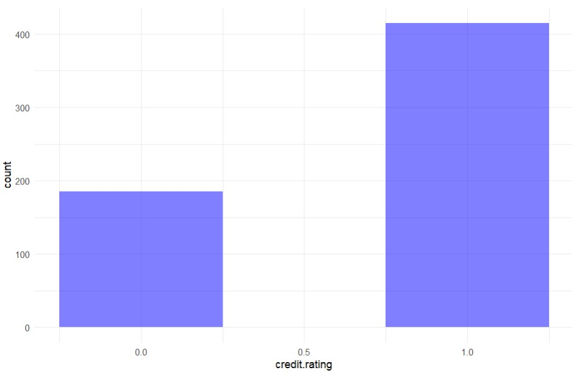
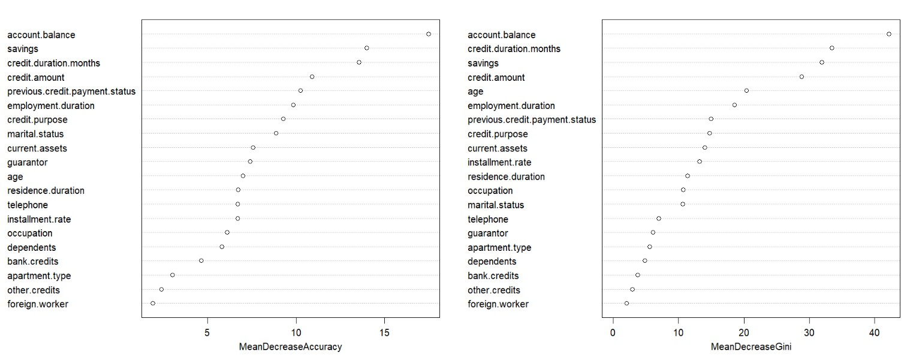
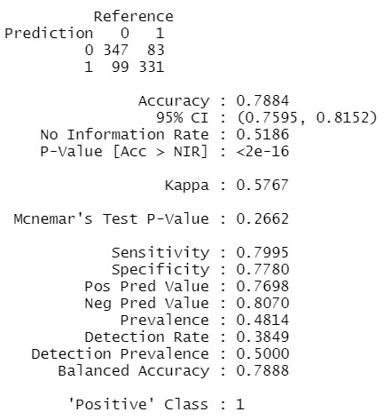
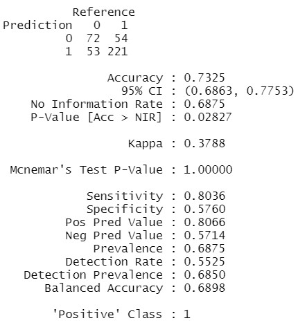
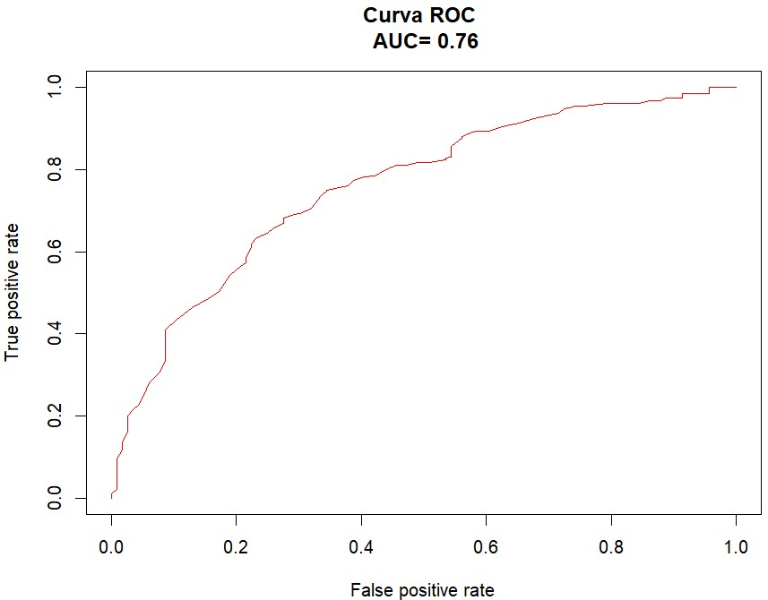
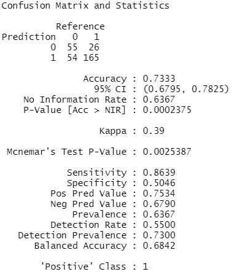

<h1 align="middle">Prevendo se o crédito deve ser ou não concedido. </h1>

<p align="center">
  
</p>

# Índice
* [Sobre o Projeto](#computer-sobre-o-projeto)
* [Descrição Geral do Problema](#gear-descrição-geral-do-problema)
* [Familiarizando-se com o Dataset](#mag-familiarizando-se-com-o-dataset)
  * [Carregando bibliotecas e dataset](#carregando-bibliotecas-e-dataset)
  * [Exploração inicial dos dados](#exploração-inicial-dos-dados)
  * [Pré-Processamento](#pré-processamento)
  * [Balanceamento dos dados de treino](#balanceamento-dos-dados-de-treino )
* [Solução do Problema](#rocket-solução-do-problema)
  * [Construindo Modelo de 'Random Forest'](#construindo-modelo-de-random-forest)
  * [Testando e Avaliando o Modelo de 'Random Forest'](#testando-e-avaliando-o-modelo-de-random-forest)
  * [Construindo Modelo de 'Regressão Logística'](#construindo-modelo-de-regressão-logística)
  * [Testando e Avaliando o Modelo de 'Regressão Logística'](#testando-e-avaliando-o-modelo-de-regressão-logística)
  * [Comparando Modelos](#comparando-modelos)
* [Conclusão e Considerações Finais](#bulb-conclusão-e-considerações-finais)
* [Autor](#superhero-autor)

## :computer: Sobre o Projeto
<td><p align=justify>O objetivo deste projeto é praticar o conhecimento adquirido em Machine Learning. Neste projeto foram construídos dois Modelos Preditivos de classificação (Random Forest e Regressão Logística) para prever se o crédito deve ser ou não concedido a determinado cliente de uma instituição financeira, dadas algumas características conhecidas. Para o desenvolvimento do projeto foi utilizada linguagem R (versão 4.2.0) juntamente com as bibliotecas 'ROCR' (versão 1.0-11), 'pROC' (versão 1.18.0), 'caret' (versão 6.0-92), 'randomForest' (versão 4.7-1.1) e 'RSBID' (versão 0.0.2.0000).</p></td>

## :gear: Descrição Geral do Problema
<td><p align=justify>Como forma de reduzir o risco na concessão de crédito, os bancos e instituições financeiras estão sempre gerando melhorias em seus processos de
análise de crédito, nesse sentindo, entendemos como necessário o desenvolvimento de soluções capazes de avaliar se um cliente conseguirá ou não pagar por um empréstimo.</p></td>

## :mag: Familiarizando-se com o Dataset
<td><p align=justify>Para o desenvolvimento do Projeto foram utilizados dados fictícios de 1000 clientes de uma instituição financeira, considerando as seguintes caracterísicas: classificação de crédito, saldo da conta, meses de duração do crédito, status de pagamento de crédito anterior, finalidade do crédito, quantia do crédito, poupança, duração do emprego, taxa de parcelamento, estado civil, fiador, duração da residência, ativo circulante, idade, outros créditos, tipo de apartamento, créditos bancários, ocupação, dependentes, telefone e se é trabalhador estrangeiro.</p></td>

### Carregando bibliotecas e dataset
```
library(RSBID)
library(randomForest)
library(ROCR)
library(pROC)
library(caret)
```
```
df <- read.csv("credito.csv")
```

### Exploração inicial dos dados
<p align="center">
<i>Primeiras linhas do 'dataset'</i>
</p>
<p align="center">
  
</p>

<p align="center">
<i>Resumo estatístico</i>
</p>
<p align="center">
  
</p>

<p align="center">
<i>Histograma das variáveis "credit.amount" e "age" </i>
</p>
<p align="center">
  
</p>

### Pré-Processamento

Transformando todas as variáveis numéricas em categóricas (exceto "credit.duration.months", "credit.amount" e "age")
```
for (i in colnames(df,do.NULL = FALSE,prefix = "col")){
  if(i!="credit.duration.months"&i!="credit.amount"&i!="age")
  df[,i] <- as.factor(df[,i])
}
```
Normalizando (padronizando) as variáveis "credit.duration.months", "credit.amount" e "age" 
```
scale.features <- function(df, variables){
  for (variable in variables){
    df[[variable]] <- scale(df[[variable]], center=T, scale=T)
  }
  return(df)
}
numeric.vars <- c("credit.duration.months", "age", "credit.amount")
df <- scale.features(df, numeric.vars)
```
Split dos dados (70% para dados de treino e 30% para dados de teste)
```
indexes <- sample(1:nrow(df), size = 0.7 * nrow(df))
df_train <- df[indexes,]
df_test <- df[-indexes,]
```
### Balanceamento dos dados de treino 
Balanceamento
```
df_train <- SMOTE_NC(df_train, 'credit.rating', perc_maj = 100, k = 5)
```
<p align="center">
<i>Histograma da variável "credit.rating antes do balanceamento</i>
</p>
<p align="center">
  
</p>
<p align="center">
<i>Histograma da variável "credit.rating após o balanceamento</i>
</p>
<p align="center">
  
</p>

<td><p align=justify>Como podemos observar pelo histograma da variável "credit.rating", existia uma grande diferença entre o número de créditos concedidos ("1") e os não concedidos ("0"), o processo de balanceamento (oversampling) corrigiu tal discrepância entre os dados, o que possibilitará um melhor aprendizado para o modelo a ser construído nas próximas etapas deste projeto.</b></p></td>

## :rocket: Solução do Problema
<td><p align=justify>Uma vez que concluímos as etapas de exploração dos dados e pré-processamento, buscaremos agora uma solução para o problema inicialmente proposto: <b>Desenvolver uma solução capaz de avaliar se um cliente conseguirá ou não pagar por um empréstimo</b>. Para isso ocorrer, entendemos como necessária a construção de um modelo preditivo de classificação, neste caso desenvolveremos dois modelos, um do tipo <b>Random Forest</b> e outro de <b>Regressão Logística.</b></p></td>

### Construindo Modelo de 'Random Forest'

Inicialmente serão utilizadas todas as variáveis para construção do Modelo e posteriormente será verificada a importância de cada uma delas
```
modelo_RF <- randomForest( credit.rating ~ .,
                        data = df_train, 
                        ntree = 100, nodesize = 10, importance = T)
varImpPlot(modelo_RF)
```
Verificando a relevância de cada variável para o modelo
<p align="center">
  
</p>

Podemos observar que algumas variáveis são mais relevantes do que outras para o desempenho do modelo, como saldo na conta, poupança, meses de duração do crédito, quantia do crédito, etc. Portanto, eliminaremos do nosso modelo algumas variáveis que entendemos ser menos relevantes.

```
modelo_RF <- randomForest( credit.rating ~ . -foreign.worker
                        -dependents
                        -other.credits
                        -occupation
                        -bank.credits
                        -apartment.type
                        -telephone
                        -marital.status
                        -guarantor,
                        data = df_train, 
                        ntree = 100, nodesize = 10, importance = T)
                        
# Gerando Confusion Matrix com o Caret
confusionMatrix(df_train$credit.rating, modelo_RF$predicted, positive = '1')
```
'Confusion Matrix' com dados de treino
<p align="center">
  
</p>

O modelo apresentou resultado considerado relativamente "bom" nas previsões com os dados de treino 

### Testando e Avaliando o Modelo de 'Random Forest'

Fazendo as predições com os dados de teste e gerando a 'Confusion Matrix'
```
# Gerando previsoes nos dados de teste
result_previsto_RF <- data.frame( actual = df_test$credit.rating,
                               previsto = predict(modelo_RF, newdata = df_test))
                               
# Gerando Confusion Matrix com o Caret
confusionMatrix(result_previsto_RF$actual, result_previsto_RF$previsto, positive = '1')
```
'Confusion Matrix' com dados de teste
<p align="center">
  
</p>

Gerando a curva 'ROC' e valor da 'AUC'
```
# Gerando as classes de dados
class1_RF <- predict(modelo_RF, newdata = df_test, type = 'prob')
class2_RF <- df_test$credit.rating

# Gerando a curva ROC e valor da AUC
pred_RF <- prediction(class1_RF[,2], class2_RF)
perf_RF <- performance(pred_RF, "tpr","fpr") 
auc_RF <- performance(pred_RF, "auc")
auc_RF <- auc_RF@y.values
auc_RF <- auc_RF[[1]]
auc_RF <- round(auc_RF,2)
plot(perf_RF, col = rainbow(10),main=paste("Curva ROC","\n","AUC=",auc_RF))
```
Curva 'ROC' e valor da 'AUC'
<p align="center">
  
</p>

Analisando a Curva 'ROC' e o valor de 'AUC', podemos concluir que o Modelo de 'Random Forest' apresentou um bom desempenho, desmonstrando ser uma boa opção para solução do problema proposto. 

### Construindo Modelo de 'Regressão Logística'

Para o Modelo de 'Regressão Logística' utilizaremos as mesmas variáveis utilizadas no Modelo 'Random Forest'
```
modelo_RL <- glm(credit.rating ~ . -foreign.worker
                -dependents
                -other.credits
                -occupation
                -bank.credits
                -apartment.type
                -telephone
                -marital.status
                -guarantor, 
                data = df_train, family = "binomial")
               
# Visualizando o modelo
summary(modelo_RL)

# Gerando Confusion Matrix com o Caret
confusionMatrix(df_train$credit.rating, as.factor(round(modelo_RL$fitted.values)), positive = '1')
```
'Confusion Matrix' com dados de treino
<p align="center">
  
</p>

Assim como no Modelo de 'Random Forest', o Modelo de 'Regressão Logística' também apresentou resultado considerado bom nas previsões com os dados de treino. 

### Testando e Avaliando o Modelo de 'Regressão Logística'

Fazendo as predições com os dados de teste e gerando a 'Confusion Matrix'
```
# Gerando previsoes nos dados de teste
result_previsto_RL <- data.frame( actual = df_test$credit.rating,
                                  previsto = as.factor(round(predict(modelo_RL, newdata = df_test, type = 'response'))))

# Gerando Confusion Matrix com o Caret
confusionMatrix(result_previsto_RL$actual, result_previsto_RL$previsto, positive = '1')
```
'Confusion Matrix' com dados de teste
<p align="center">
  
</p>

Gerando a curva 'ROC' e valor da 'AUC'
```
# Gerando as classes de dados
class1_RL <- predict(modelo_RL, newdata = df_test, type = 'response')
class2_RL <- df_test$credit.rating

# Gerando a curva ROC
pred_RL <- prediction(class1_RL, class2_RL)
perf_RL <- performance(pred_RL, "tpr","fpr") 
auc_RL <- performance(pred_RL, "auc")
auc_RL <- auc_RL@y.values
auc_RL <- auc_RL[[1]]
auc_RL <- round(auc_RL,2)
plot(perf_RL,col = rainbow(10),main=paste("Curva ROC","\n","AUC=",auc_RL))
```
Curva 'ROC' e valor da 'AUC'
<p align="center">
  
</p>

Analisando a Curva 'ROC' e o valor de 'AUC', podemos concluir que o Modelo de 'Regressão Logística' apresentou um bom desempenho, desmonstrando também ser uma boa opção para solução do problema proposto. 

### Comparando Modelos
Comparando curvas 'ROC' e valor da 'AUC' dos dois modelos
```
#Comparando modelos (biblioteca pROC)
roc_RL <- roc(class2_RL , class1_RL, percent = TRUE)
roc_RF <- roc(class2_RF , class1_RF[,2], percent = TRUE)
par(pty = "s")
plot(roc_RL, print.auc = TRUE, col = "blue", main = "Curva ROC - Random Forest (Green) x Regressão Logística (Blue)", legacy.axes = TRUE, 
     xlab = "% de Falso Positivo (100 - Especificidade)",
     ylab = "% de Verdadeiro Positivo (Sensibilidade)")
plot(roc_RF, print.auc = TRUE, col = "green", print.auc.y = 40, add = TRUE, legacy.axes = TRUE)
```
<p align="center">
  
</p>

<td><p align=justify>Como pode ser facilmente observado na figura acima, os modelos desenvolvidos apresentam desempenhos muito parecidos, estando ambos aptos a serem a solução para o problema proposto!</p></td>

## :bulb: Conclusão e Considerações Finais

<td><p align=justify>Após passar pelas etapas de exploração e pré-processamento dos dados, construção e treinamento dos Modelos Preditivos, concluímos nosso trabalho e encontramos, através dos Modelos de 'Random Forest' e 'Regressão Logística' , a solução para o problema proposto. As próximas etapas passariam pela entrega dos resultados às equipes responsáveis pelo desenvolvimento e implantação de um sistema que, baseado nos modelos preditivos propostos, receba os dados dos clientes e devolva as previsões das análises de crédito em formato adequado. Tais informações seriam de extrema utilidade para os setores responsáveis pelo planejamento e gestão financeira da empresa. Obviamente que os modelos construídos carecem de otimizações, devendo passar por ajustes finos e constantes melhorias, de modo a obter sempre o melhor desempenho.</p></td>

## :superhero: Autor
 
<i>Willian Ventura</i>
<div>
   <a href = "mailto:willvent10@gmail.com"></a>
  <a href="https://www.linkedin.com/in/willian-ventura-117269217/" target="_blank"></a>   
</div>
